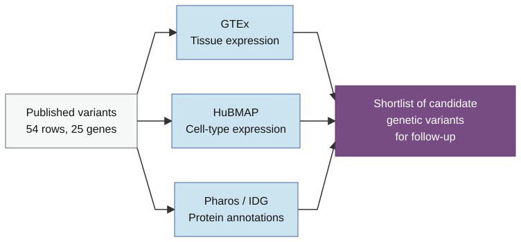

## Prioritizing candidate genetic variants {.title-slide-custom}

Using GTEx, HuBMAP, and Pharos to add gene-level data

Shaurita D. Hutchins

## What you will learn

- How to use tissue expression, cell-type expression, and protein annotations to
identify candidate genetic variants for follow-up.

- How to access APIs with Python programming to retrieve data from GTEx, HuBMAP, and Pharos.

- How to use the results to generate additional hypotheses.

## Before you begin

- Basic knowledge of Python is required.

- The tutorial exists in two formats:
  - You can use the interactive browser tutorial.
  - Or you can use the matching Jupyter notebooks.
- Both approaches are encouraged based on your experience.

## This tutorial's structure

::: {.workflow-figure}

:::

Ask a biological question, retrieve data, inspect the result, and
select variants for follow-up.

Resources:
<a href="https://gtexportal.org/home/">GTEx</a>,
<a href="https://portal.hubmapconsortium.org/">HuBMAP</a>, and
<a href="https://pharos.nih.gov/">Pharos</a>.

